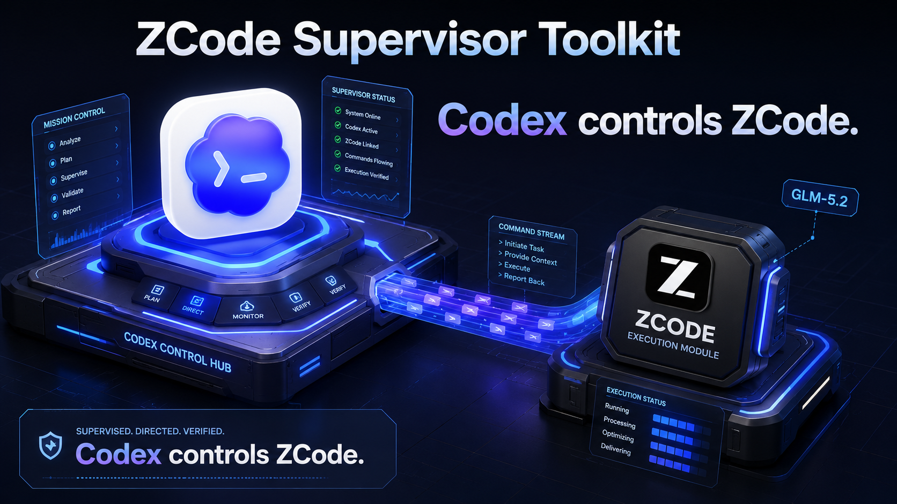

<p align="right">
  <a href="./README.md"><kbd>Switch to English</kbd></a>
  <a href="./README.ja.md"><kbd>日本語</kbd></a>
</p>

# ZCode-supervisor


ZCode に実装を任せながら、Codex の判断と監査は手放さない。

ZCode-supervisor は、ZCode を「範囲限定の実装 worker」として使うための
toolkit です。Codex が task を計画し、編集してよい files と validation command
を決め、結果を監査し、最後の受け入れ判断を持ちます。ZCode には repo 全体を
自由に触らせず、明確な作業 packet だけを渡します。

AI coding の速度を上げつつ、見張り続ける負担を減らすために作っています。

- routine implementation を ZCode に任せても、Codex review は残せる
- 編集範囲を explicit files と validation command に閉じ込められる
- 範囲外変更、failed checks、provider errors、unsafe paths を検出できる
- target repo は `uvx` 1 command でセットアップし、dry route check から始められる

**Language:** [Switch to English](./README.md)

このリポジトリは Z.AI / ZCode 公式プロジェクトではありません。

## クイックスタート

現在の public setup path は、PyPI package を `uvx` で実行する方法です。

```bash
uvx --from zcode-supervisor zcode-install-repo /ABSOLUTE/PATH/TO/YOUR/TARGET_REPO
```

最初の delegated task の前に route check をします。

```bash
uvx --from zcode-supervisor zcode-auto-route \
  --workspace /ABSOLUTE/PATH/TO/YOUR/TARGET_REPO \
  --objective "setup smoke check"
```

source から開発する場合は、この repo を clone して underlying Python command を直接使えます。

```bash
git clone https://github.com/AkiGarage/ZCode-supervisor.git
cd ZCode-supervisor
python3 tools/zcode_supervisor/zcode_supervisor.py install-repo \
  --repo /ABSOLUTE/PATH/TO/YOUR/TARGET_REPO \
  --write-agents
```

Homebrew tap は一旦 archived 扱いです。source work では
`AkiGarage/ZCode-supervisor` を clone してください。

release 詳細と検証 command は [docs/distribution.md](docs/distribution.md) にあります。

## Codex にセットアップしてもらう

Codex に頼む場合は、下の prompt を丸ごとコピーして Codex に貼ってください。
GitHub では code block の右上に copy button が出ます。
`/ABSOLUTE/PATH/TO/YOUR/TARGET_REPO` だけ、ZCode に手伝ってほしい repo の
絶対パスに置き換えてください。

```text
あなたは Codex です。次の target repo に ZCode-supervisor をセットアップしてください。

TARGET_REPO=/ABSOLUTE/PATH/TO/YOUR/TARGET_REPO

目的:
target repo を ZCode-supervisor workflow で使える状態にしてください。
Codex は planning、orchestration、validation、audit、recovery、final acceptance を担当し、
ZCode は zcodectl run-packet 経由の bounded implementation だけを担当します。

ルール:
- 慎重に、非破壊で進めてください。
- secrets、.env files、credentials、API keys、private keys、token files を読んだり表示したりしないでください。
- setup 中に target repo の application source code は編集しないでください。
- TARGET_REPO が placeholder のままなら止まり、実際の絶対パスを聞いてください。
- 必要な app や tool が足りない場合は、足りないものと次に実行すべき command または official link を示して止まってください。
- push、commit、branch 削除、本番挙動の変更はしないでください。

手順:
1. TARGET_REPO が存在し、git repository であることを確認してください。
2. PyPI-backed `uvx` path を優先してください。`uvx --version` が動く場合は
   INSTALLER_MODE=uvx とし、clone は不要です。`uvx` がない場合は次の official
   install link を示してから source fallback に進んでください。
   https://docs.astral.sh/uv/getting-started/installation/
3. source fallback の場合だけ local の ZCode-supervisor repo を探してください。
   ~/dev/ZCode-supervisor があれば優先してください。
   見つかった実際の絶対パスを SUPERVISOR_REPO に入れてください。
   なければ次で clone してください。
   mkdir -p ~/dev
   git clone https://github.com/AkiGarage/ZCode-supervisor.git ~/dev/ZCode-supervisor
   clone に失敗したら、正確な error を報告して止まってください。
4. local basics を確認してください。
   - node --version は >= 22
   - python3 --version は >= 3.11
   - git --version が動くこと
5. ZCode が install 済みか確認してください。なければ official install link を示してください。
   https://zcode.z.ai/en/docs/install
6. Terminal または shell で target repo installer を実行してください。
   INSTALLER_MODE=uvx の場合:
   uvx --from zcode-supervisor \
     zcode-install-repo "$TARGET_REPO"
   それ以外は source fallback を実行します。
   python3 "$SUPERVISOR_REPO/tools/zcode_supervisor/zcode_supervisor.py" install-repo \
     --repo "$TARGET_REPO" \
     --write-agents
7. TARGET_REPO の中に次の files ができたことを確認してください。
   - .codex/zcode-routing.json
   - .codex/ZCODE_DELEGATION.md
   - .agents/mcp.json
   - AGENTS.md
8. dry route check を実行してください。INSTALLER_MODE=uvx の場合:
   uvx --from zcode-supervisor \
     zcode-auto-route \
     --workspace "$TARGET_REPO" \
     --objective "setup smoke check"
   それ以外は次を実行してください。
   python3 "$SUPERVISOR_REPO/tools/zcode_supervisor/zcode_supervisor.py" auto-route \
     --workspace "$TARGET_REPO" \
     --objective "setup smoke check"
9. 可能なら preflight も実行してください。INSTALLER_MODE=uvx の場合:
   uvx --from zcode-supervisor \
     zcodectl cli-preflight
   uvx --from zcode-supervisor \
     zcodectl vision-preflight --workspace "$TARGET_REPO"
   それ以外は次を実行してください。
   node "$SUPERVISOR_REPO/tools/zcode_control/zcodectl.mjs" cli-preflight
   node "$SUPERVISOR_REPO/tools/zcode_control/zcodectl.mjs" vision-preflight --workspace "$TARGET_REPO"
10. 最後に次を報告してください。
   - 書き込んだもの
   - 実行した commands
   - 各 check の pass/fail
   - 手動でまだ必要なこと
   - 最初の real delegated task で使うべき正確な command

成功条件:
target repo に routing files が入り、dry route check が動き、残っている手動 prerequisite が明確になっていること。
```

## セットアップ手順: target repo に導入する

初めて使うときはここから進めてください。目的は、既存の1つの repo に
「Codex が計画と監査を担当し、ZCode が範囲限定の実装だけを担当する」
ための目印を入れることです。

### 0. 2つの repo を区別する

- **この repo:** `ZCode-supervisor`。supervisor tool が入っています。
- **target repo:** ZCode に手伝ってほしい、あなたの目的の repo です。
  `zcode-install-repo` に渡すのはこちらの path です。

`/path/to/target-repo` はそのまま打つ文字ではありません。あなたの目的の repo の
絶対パスに置き換えてください。例:

```bash
~/work/my-app
```

絶対パスが分からない場合は、Terminal で target repo に移動して `pwd` を実行します。

```bash
pwd
```

### 1. この supervisor repo を手元に置く

GitHub 上で読んでいて、まだ local に repo がない場合は clone します。

```bash
git clone https://github.com/AkiGarage/ZCode-supervisor.git
cd ZCode-supervisor
pwd
```

ここで出る `pwd` の結果が、この supervisor repo の絶対パスです。
clone 先が `~/dev/ZCode-supervisor` ではない場合、以降の例に出る
`~/dev/ZCode-supervisor` を自分の supervisor repo path に置き換えてください。

### 2. 必要な app と tool を準備する

まず ZCode を install し、sign in と provider 設定を済ませます。

- ZCode install docs: https://zcode.z.ai/en/docs/install

必要要件:

- ZCode desktop app が install 済みで、model provider に接続されていること。
- Node.js `>=22`
- Python `>=3.11`
- Git
- macOS Terminal などの POSIX-like shell
- configured model provider への network access

local tool を確認します。

```bash
node --version
python3 --version
git --version
```

### 3. Terminal で installer を実行する

これは Terminal で実行してください。今いる folder はどこでも大丈夫です。
target repo を絶対パスで渡すので、current directory に依存しません。

```bash
zcode-install-repo /ABSOLUTE/PATH/TO/YOUR/TARGET_REPO
```

例:

```bash
zcode-install-repo ~/work/my-app
```

これは setup 用 command です。target repo ごとに1回だけ実行します。
task ごとに毎回実行するものではありません。

`zcode-install-repo` が見つからない場合は、この supervisor repo の command を
直接実行します。

```bash
python3 /absolute/path/to/ZCode-supervisor/tools/zcode_supervisor/zcode_supervisor.py install-repo \
  --repo /ABSOLUTE/PATH/TO/YOUR/TARGET_REPO \
  --write-agents
```

supervisor repo が別の場所にある場合は、`/absolute/path/to/ZCode-supervisor` を
step 1 の `pwd` で出た絶対パスに置き換えてください。

### Primary install path

現在の public setup path は、PyPI package を `uvx` で実行する方法です。

```bash
uvx --from zcode-supervisor zcode-install-repo /ABSOLUTE/PATH/TO/YOUR/TARGET_REPO
```

PyPI package は long-lived PyPI token ではなく Trusted Publishing で publish 済みです。
より慎重な user は現在の GitHub Release archive `v0.0.1` を download し、
`SHA256SUMS` と `gh attestation verify` で検証してから使えます。Homebrew は
一旦 archived 扱いです。[docs/distribution.md](docs/distribution.md) を参照してください。

maintainer は TestPyPI / PyPI publish 前に
[docs/pypi-trusted-publisher.md](docs/pypi-trusted-publisher.md) を使ってください。

### 4. target repo に書かれたものを確認する

installer は target repo の中に次を作ります。

- `.codex/zcode-routing.json`
- `.codex/ZCODE_DELEGATION.md`
- `.agents/mcp.json`
- `--write-agents` を使った場合は `AGENTS.md` への pointer

大事な役割分担は1つです。Codex は planning、orchestration、validation、
audit、recovery、final acceptance を持ちます。ZCode は `zcodectl run-packet`
経由の bounded implementation だけを担当します。

### 5. 編集前に route を確認する

実装作業の前に dry run で route を確認します。

```bash
uvx --from zcode-supervisor zcode-auto-route \
  --workspace /ABSOLUTE/PATH/TO/YOUR/TARGET_REPO \
  --objective "Fix the failing ledger summary test."
```

よく見る結果:

- `needs_codex_planning`: Codex が allowed files と validation を先に決めます。
- `delegate_zcode`: ZCode に任せる準備ができています。
- `codex_direct`: Codex が直接扱って大丈夫です。
- `ask_user`: high-risk なので一度止めて確認します。

### 6. 実際に ZCode に範囲限定で任せる

Codex が編集範囲と検証 command を決めたら実行します。

```bash
uvx --from zcode-supervisor zcode-auto-route \
  --workspace /ABSOLUTE/PATH/TO/YOUR/TARGET_REPO \
  --objective "Fix the failing ledger summary test." \
  --allowed src/ledger.js \
  --validation "npm test" \
  --execute
```

`--allowed` には ZCode が編集してよい file だけを書きます。`--validation` には
Codex が最初の安全確認として信頼する command を書きます。どちらも小さく、
具体的にするほど安全です。

### 最初の実行で困ったとき

- `command not found: zcode-install-repo`: 上の `python3 ... install-repo` の
  direct command を使うか、この repo の `scripts/` directory を PATH に追加します。
- `repo does not exist`: `/path/to/target-repo` のままではなく、`pwd` で確認した
  絶対パスに置き換えてください。
- ZCode が prompt を実行できない: ZCode を一度開き、sign in と provider 設定を
  済ませてから、この repo で
  `node tools/zcode_control/zcodectl.mjs cli-preflight` を実行します。
- screenshot / vision task が失敗する:
  `node tools/zcode_control/zcodectl.mjs vision-preflight --workspace /ABSOLUTE/PATH/TO/YOUR/TARGET_REPO`
  を実行します。

## リポジトリ概要

- **現在の version:** `v0.0.1`
- **主な用途:** ZCode/GLM に限定された implementation task を委譲し、
  Codex が planning、guardrails、validation、audit、final review を担当します。
- **主な実行経路:** `node tools/zcode_control/zcodectl.mjs run-packet`
- **役割分担:** isolated workspace / worktree、実行前 snapshot、実行後 audit、
  scope 外・危険・検証失敗の変更 reject を基本にします。
- **向いている用途:** low-babysitting な AI coding workflow、tool 比較、
  token/quota を見ながらの委譲、supervised benchmark run。

## 最初に読む場所

- 初めて使う場合: [セットアップ手順](#セットアップ手順-target-repo-に導入する) と
  [Codex と ZCode の役割分担](#codex-と-zcode-の役割分担)
- headless ZCode を使う場合:
  [要件と操作経路](#要件と操作経路) と [ZCode Desktop Control](#zcode-desktop-control)
- token / quota を記録する場合:
  [Usage, Token, And Quota Logging](#usage-token-and-quota-logging)
- 今後の計画:
  [ROADMAP.md](ROADMAP.md) と [CHANGELOG.md](CHANGELOG.md)

## できること

- `zcode_supervisor` で task packet 作成、workspace snapshot、ZCode 実行後の
  audit を行えます。
- `zcodectl` で ZCode desktop app に同梱された headless CLI を制御できます。
- target repo に `.codex/zcode-routing.json`、`.codex/ZCODE_DELEGATION.md`、
  `.agents/mcp.json`、`AGENTS.md` pointer を導入できます。
- `zcode-auto-route` で実装 task を ZCode に委譲するか、Codex が直接扱うか、
  high-risk として止めるかを JSON で判定できます。
- image / screenshot task では `zai-mcp-server` を使う vision packet と、
  pixel-exact color sampling を扱えます。
- provider overload、retry、partial artifact、usage availability、quota percent
  を machine-readable に記録できます。
- ZCode release baseline の monitor と GitHub Actions workflow があります。
- repo-local Codex hook shim により、設定済みなら `codex-usage-ledger` へ
  session start / stop を記録し、使えない場合は local pending JSONL に退避します。

## Version

現在の release は `v0.0.1` です。

Distribution and release preparation: [docs/distribution.md](docs/distribution.md)

- `VERSION`: `0.0.1`
- `package.json`: `0.0.1`
- `pyproject.toml`: `0.0.1`
- release notes: [CHANGELOG.md](CHANGELOG.md)

## Codex と ZCode の役割分担

この project の考え方は単純です。

- Codex が plan、allowed files、validation command、audit result、final acceptance を決めます。
- ZCode は Codex が明示的に委譲した bounded implementation だけを担当します。

想定 workflow は次の通りです。

1. Codex が compact な task packet を作ります。
2. Codex が workspace snapshot を取ります。
3. ZCode が isolated workspace または worktree 内で作業します。
4. Codex が supervisor audit を実行します。
5. Codex が独立して結果を review し、accept / reject を判断します。

`Full access` は disposable workspace または isolated worktree で使う想定です。
packet 作成は regular workspace での `Full access` を default で block し、
明らかに destructive な validation command も reject します。

supervisor audit は forbidden edit、allowed file set 外の変更、changed file
count 超過、validation failure、workspace mismatch、secret-like content を
検出して失敗させます。

## セットアップ後のコマンドリファレンス

この section の例では短い placeholder path を使っています。`/path/to/target-repo`
や `/path/to/repo` は、上のセットアップ手順と同じように、実際の target repo の
絶対パスに置き換えてください。

target repo に routing hint を一度だけ入れます。

```bash
zcode-install-repo /path/to/target-repo
```

これは task ごとに走らせる command ではなく、repo setup 用です。

この command は target repo に `.codex/zcode-routing.json`、
`.codex/ZCODE_DELEGATION.md`、`.agents/mcp.json` を書き、`AGENTS.md` に小さな
pointer を追加します。Codex は planning、orchestration、audit、validation、
final acceptance を持ち続け、ZCode は `zcodectl run-packet` 経由の bounded
implementation だけを担当します。`.agents/mcp.json` には vision packet 用の
recommended `zai-mcp-server` stdio entry が入ります。API key は repo には書きません。

PATH wrapper がない場合は、下の underlying command を使えます。

```bash
python3 /path/to/ZCode-supervisor/tools/zcode_supervisor/zcode_supervisor.py install-repo \
  --repo /path/to/target-repo \
  --write-agents
```

### Auto Routing

installed repo は default で `routing_mode: auto` になります。実装編集の前に
route check を走らせると、Codex が次の行動を JSON で判断できます。

```bash
uvx --from zcode-supervisor zcode-auto-route \
  --workspace /path/to/target-repo \
  --objective "Fix the failing ledger summary test."
```

毎回 setup / check / execute の3つを全部走らせる必要はありません。

- 初回 setup:
  `uvx --from zcode-supervisor zcode-install-repo /path/to/target-repo`
- route の確認:
  `uvx --from zcode-supervisor zcode-auto-route --workspace ... --objective ...`
- 実際の delegated implementation: Codex が scope と validation を決めてから
  `uvx --from zcode-supervisor zcode-auto-route ... --allowed ... --validation ... --execute`

router の主な結果は次の通りです。

- `delegate_zcode`: packet を作って ZCode を実行します。
- `needs_codex_planning`: Codex が allowed-file set と validation command を
  先に決めます。
- `codex_direct`: read-only、trivial、routing config missing、`no-zcode` 指定など。
- `ask_user`: destructive changes、migration、credentials、production、
  money-sensitive task など high-risk category。

実行例:

```bash
uvx --from zcode-supervisor zcode-auto-route \
  --workspace /path/to/target-repo \
  --objective "Fix the failing ledger summary test." \
  --allowed src/ledger.js \
  --validation "npm test" \
  --execute
```

`--execute` は packet を作り、`zcodectl run-packet` を呼び、結果を
`.codex/zcode/runs/` に書きます。最終 acceptance は Codex が担当します。

### Manual Packet Flow

直接 packet を作ることもできます。

```bash
python3 tools/zcode_supervisor/zcode_supervisor.py packet \
  --workspace benchmarks/zcode-goal-mode \
  --objective "Fix summarizeLedger so npm test passes." \
  --allowed src/ledger.js \
  --forbidden test/ledger.test.js \
  --validation "npm test" \
  --effort max \
  --task-class root-cause \
  --risk-budget low \
  --max-changed-files 1 \
  --goal \
  --out .local/packets/ledger.json \
  --prompt-out .local/packets/ledger.prompt.txt
```

snapshot:

```bash
python3 tools/zcode_supervisor/zcode_supervisor.py snapshot \
  --workspace benchmarks/zcode-goal-mode \
  --out .local/snapshots/ledger.before.json
```

audit:

```bash
python3 tools/zcode_supervisor/zcode_supervisor.py audit \
  --workspace benchmarks/zcode-goal-mode \
  --snapshot .local/snapshots/ledger.before.json \
  --packet .local/packets/ledger.json
```

## 要件と操作経路

この toolkit は Codex Computer Use を必須にしません。推奨経路は ZCode desktop
app に同梱された headless CLI です。

```text
Codex or normal terminal
  -> node tools/zcode_control/zcodectl.mjs
  -> ZCode bundled CLI
  -> ZCode / GLM task execution
```

優先順位:

1. **ZCode bundled headless CLI:** `cli-prompt` と `run-packet` が使う推奨経路。
   macOS + ZCode 3.1.2 で validation 済みです。
2. **`cua-driver` + Electron CDP:** `cua-driver` は Cua project による
   MIT-licensed background computer-use driver です。
   https://cua.ai/docs/cua-driver/guide/getting-started/introduction
   利用可能な場合、この種の desktop-control surface を通じて visible text の
   inspection、screenshot、click、visible Usage Stats 読み取りを行えます。
   Cua authors の computer-use driver work に敬意を払い、この project では
   primary delegation path ではなく optional diagnostic/control surface として扱います。
3. **Codex Computer Use:** GUI 操作が必要な場合の optional fallback です。

minimum local tooling:

- ZCode desktop app installed and connected to a model provider.
- Node.js `>=22`
- Python `>=3.11`
- Git and a POSIX-like shell for `scripts/check.sh`
- configured model provider への network access

official ZCode install docs 上の supported platforms:

- macOS on Apple Silicon and Intel
- Windows
- Linux through the Linux beta group

official docs: https://zcode.z.ai/en/docs/install

Project support status:

| Platform | Status | Notes |
| --- | --- | --- |
| macOS | Tested | ZCode 3.1.2、bundled CLI path `/Applications/ZCode.app/Contents/Resources/glm/zcode.cjs`、bundled CLI version `0.14.8`、GUI config path `~/.zcode/v2/config.json`、CLI config path `~/.zcode/cli/config.json`。 |
| Windows | Expected, not verified | ZCode 公式 supported。3.1.2 で Windows shell selection が追加されていますが、この project では Windows-specific CLI path discovery と shell validation は未検証です。 |
| Linux | Expected/beta, not verified | Linux packages は official beta group 経由。CLI path、desktop launch、config discovery は未検証です。 |

## ZCode Desktop Control

ZCode 3.1.2 以降では、可能な限り bundled headless CLI を使います。

```bash
node tools/zcode_control/zcodectl.mjs cli-path
node tools/zcode_control/zcodectl.mjs cli-preflight
node tools/zcode_control/zcodectl.mjs bootstrap-cli-config \
  --provider zai \
  --model glm-5.2
node tools/zcode_control/zcodectl.mjs cli-doctor
node tools/zcode_control/zcodectl.mjs run-packet \
  --packet .local/packets/ledger.json \
  --mode plan \
  --max-attempts 2 \
  --retry-delay-ms 60000 \
  --usage-snapshot-source auto \
  --out .local/runs/ledger.zcode.json
```

`run-packet` は packet workspace を `--cwd` として ZCode CLI に prompt を渡します。
CLI config が未準備の場合は、local ZCode desktop GUI config から bootstrap を試します。
無効化したい場合は `--no-bootstrap` を指定します。

provider overload は structured supervisor state として扱われます。

- `success`: CLI が正常終了し、audit と validation も通過。
- `audit_failed`: CLI は正常終了したが、audit または validation が失敗。
- `partial_success`: provider error 後に scoped changes が残り、audit と validation が通過。
- `retryable_provider_error`: file change なしの provider error。
- `unsafe_partial`: changed files が scope、validation、safety check に失敗。

result JSON には `cli_ok`、`provider_error`、`provider_code`、
`provider_message`、`provider_id`、`provider_kind`、`usage_available`、
`attempts`、`retry_count`、`retry_delays_ms`、`safe_to_retry_later`、
`partial_artifacts_possible`、`audit`、`validation`、`validation_ok`、
`attempt_results` などが入ります。

## Image And Vision Tasks

この supervisor では GLM-5.2 を text-only として扱います。image understanding は
ZCode built-in image service と recommended `zai-mcp-server` MCP service に寄せます。

```bash
python3 tools/zcode_supervisor/zcode_supervisor.py packet \
  --workspace benchmarks/zcode-goal-mode \
  --objective "Implement the UI state shown in the screenshot." \
  --allowed src/ledger.js \
  --validation "npm test" \
  --vision-image screenshots/state.png \
  --vision-color-sample primary=screenshots/state.png@240,420 \
  --out .local/packets/vision.json
```

`--vision-image` は image understanding required を packet に記録し、`run-packet`
が ZCode CLI に repeated `--attach` として渡します。required vision packet の実行前に、
`run-packet` は redacted ZCode MCP config を確認し、image service がない場合は
`vision_service_unavailable` で止めます。

`--vision-color-sample name=image.png@x,y` は workspace-local PNG の pixel を読み、
exact uppercase `#RRGGBB` を prompt に入れます。exact color が重要な場合は、
generic vision に任せきらず deterministic image tool でも確認します。

preflight:

```bash
node tools/zcode_control/zcodectl.mjs vision-preflight \
  --workspace benchmarks/zcode-goal-mode
```

`zcode-install-repo /path/to/repo` は `.agents/mcp.json` に次の recommended stdio
server を書きます。

```json
{
  "mcpServers": {
    "zai-mcp-server": {
      "args": ["-y", "@z_ai/mcp-server"],
      "command": "npx",
      "enable": true,
      "type": "stdio"
    }
  }
}
```

関連 docs:

- ZCode MCP services: https://zcode.z.ai/en/docs/mcp-services
- npm package: `@z_ai/mcp-server`

`zai-mcp-server` は `Z_AI_API_KEY` を期待します。required vision packet では、
`run-packet` が current environment、`ZAI_API_KEY`、または local ZCode CLI config
から利用可能な key を child process に渡します。secret value は出力しません。

## Usage, Token, And Quota Logging

`run-packet` は delegated ZCode task の before / after usage snapshot を取り、
結果 JSON に token と quota 情報を入れます。default の
`--usage-snapshot-source auto` は、まず Z.AI quota API を直接試し、失敗時に
CodexBar CLI へ fallback します。

```bash
codexbar usage --provider zai --format json
```

capture は non-fatal です。どちらも使えない場合も task execution は続き、
result JSON に snapshot error と usage availability が残ります。

主な記録内容:

- `usage_snapshots.before` / `usage_snapshots.after`: raw provider snapshots と
  normalized quota windows。
- `usage_accounting.tokens_*`: ZCode CLI JSON `usage` payload からの token fields。
- `usage_accounting.quota_percent_*`: primary used-percent quota window の before、
  after、delta。
- direct Z.AI `TOKENS_LIMIT.percentage`: 同じ window に finite `usage` と
  `remaining` がない場合でも measured used-percent として扱い、token count
  delta は invent しません。
- `usage_accounting.quota_windows`: per-window deltas と reset-change detection。

manual ledger append:

```bash
python3 tools/zcode_eval/zcode_eval.py append-result \
  --run-id zcode-ledger-001 \
  --tool zcode \
  --task-id ledger \
  --task-name "Ledger fixture" \
  --status pass \
  --tokens-before 1000 \
  --tokens-after 1450 \
  --quota-percent-before 4 \
  --quota-percent-after 5 \
  --quota-percent-direction used
```

provider-error run では `--supervisor-state`、`--provider-error`、
`--provider-code`、`--provider-message`、`--provider-id`、`--provider-kind`、
`--attempts`、`--retry-count`、`--retryable-provider-error`、
`--partial-artifacts-possible`、`--safe-to-retry-later`、
`--usage-available` / `--no-usage-available` も記録できます。

duel result import:

```bash
python3 tools/zcode_eval/zcode_eval.py import-duel-results \
  --source /path/to/ClaudeCodeGLM-supervisor/work/supervisor_duel_eval/runs/20260617-153042/results.json \
  --path artifacts/evals/zcode-vs-claude.jsonl
```

## ZCode Release Monitoring

ZCode compatibility は `config/zcode-release-baseline.json` に pin されています。
manual check:

```bash
python3 tools/zcode_eval/zcode_release.py check \
  --baseline config/zcode-release-baseline.json \
  --include-installed
```

GitHub Actions workflow `.github/workflows/zcode-release-monitor.yml` は schedule で
同じ release check を走らせます。official ZCode version が baseline より新しい場合、
`bash scripts/check.sh` を実行し、release notes と follow-up checklist 付きの
GitHub Issue を open / update します。

## Templates

`templates/zcode-codex-system/` を disposable workspace または worktree にコピーすると、
ZCode に次を渡せます。

- bounded worker contract としての `AGENTS.md`
- Skill-friendly playbook と quality gate
- parallel-work playbook
- GLM-5.2 task class、effort、context strategy 用 operating profile

現在の ZCode docs では user-defined custom subagents は未対応です。広い code research
には built-in read-only Explore subagent を使い、reusable worker behavior には
Skills / Commands を使います。legacy `.zcode/cli/agents/` template は draft role
prompt として残していますが、runtime feature としては advertise しません。

## GLM-5.2 Operating Defaults

- long-horizon implementation、cross-module debugging、architecture mapping、
  production-grade standards checks、mobile/debugging loop は `effort=max`。
- cheap probe、narrow review、小さな repair は `effort=high`。
- 1M context は durable architectural memory として扱い、毎回全 file を詰め込みません。
- `/goal` は objective acceptance criteria と exact validation command がある時だけ。
- 小さい diff が期待される時は `--max-changed-files` を指定します。
- `Full Access` の前に `--workspace-kind fixture|worktree|disposable` を使います。
- ZCode が完了しても final auditor は Codex です。

詳細:
[GLM-5.2 ZCode Operator Guide 日本語版](docs/glm-5.2-zcode-operator-guide.ja.md) /
[English](docs/glm-5.2-zcode-operator-guide.md)

## 開発

full local check:

```bash
bash scripts/check.sh
```

targeted tests:

```bash
python3 -m unittest tests/test_zcode_supervisor.py tests/test_zcode_repo_setup.py tests/test_zcode_eval.py tests/test_zcode_release.py
node --test tests/zcode_run_packet_e2e.test.mjs tests/zcode_provider_errors.test.mjs
```

core checks は Python / Node standard library 中心で動きます。

## Roadmap

v0.0.2 の focus は、human supervision を増やさずに harder real-app tasks で
ZCode worker model を証明することです。

planned benchmark tracks:

- multi-file implementation
- long-context navigation
- parallel subagent workflow
- token and quota efficiency
- safety audit

詳細: [ROADMAP.md](ROADMAP.md)

## 関連ドキュメント

- [README.md](README.md): English README
- [CHANGELOG.md](CHANGELOG.md): release notes
- [ROADMAP.md](ROADMAP.md): planned benchmark work
- [GLM-5.2 ZCode Operator Guide 日本語版](docs/glm-5.2-zcode-operator-guide.ja.md):
  long-context delegation playbook
- [GLM-5.2 ZCode Operator Guide English](docs/glm-5.2-zcode-operator-guide.md):
  long-context delegation playbook
